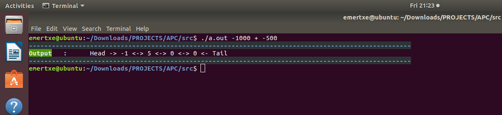
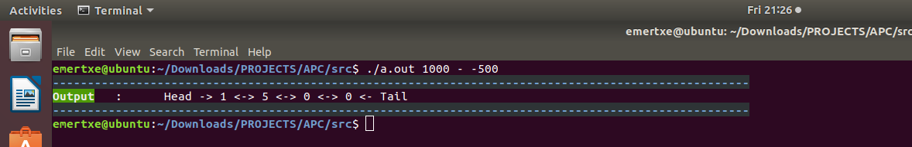
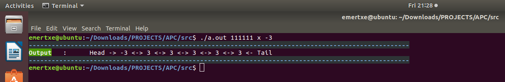
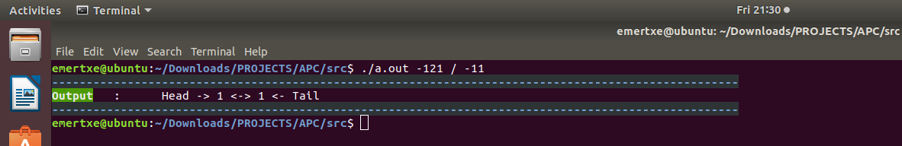
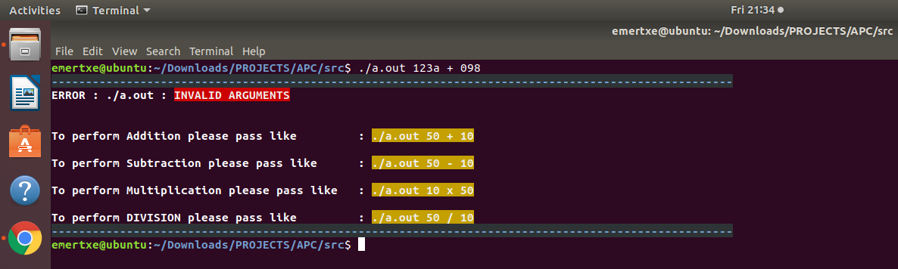

## Arbitrary Precision Calculator (APC)

## Overview

    The Arbitrary Precision Calculator (APC) is a powerful tool for performing arithmetic operations 
    on very large numbers with precision beyond the typical limits of standard data types. 
    This project demonstrates the implementation of fundamental arithmetic 
    operations using **doubly linked lists** to handle numbers of arbitrary size.

## Features

    Supports addition, subtraction, multiplication, and division of integers.

    Handles numbers with hundreds or thousands of digits.

    Efficient memory management using **dynamic memory allocation**.

## Technologies Used

    Programming Language: C

    Platform: Linux Machine(Ubuntu)

    Data structure

## Installation

    Clone the repository:

        git clone <repository-url>

    Navigate to the project directory:

        cd APC/PROJECTS/APC/src

    Compile the program on windows machine:

        gcc addition.c apc.h createList.c deleteList.c deleteFirst.c division.c insertFirst.c main.c multiplication.c printList.c subtraction.c validation.c -o output.exe

    Run the program on windows machine:

        output.exe
------------------------------------------------------
    Compile the program on linux machine:

        gcc *.c

    Run the program on linux machine:

        ./a.out

## Usage

    Input large numbers directly via the console.

    Result prints on the console itself.

## Screenshots
Addition:

Subtraction:

Multiplication:

Division:

Invalid input:

## File Structure

    apc.h: This file contains all function, structure declarations.

    main.c: Main program file containing function calls of arithmetic operation and prints the output to the screen.

    addition.c: This program file generates the addition operation output.

    subtraction.c: This program file generates the subtraction operation output.

    multiplication.c: This program file generates the multiplication operation output.

    division.c: This program file generates the division operation output.

    validation.c: This program file validates the input command line arguments from user

    createList.c: This program file creates the double linked list for user input.

    deleteList.c: This program file deletes the double linked list.

    deleteFirst.c: This program file delete the first element in the double linked list.

    insertFirst.c: This program file inserts the first element in the  double linked list.

    printList.c: This program file prints the double linked list.

    assests/screenshots/: Folder containing screenshots of the application.

## How It Works

    **Input Parsing**: The program reads numbers as strings and converts them into doubly linked lists.

    **Arithmetic Operations**: Each operation traverses the linked lists to compute results, digit by digit.

    **Output**: Results are stored back in linked list format and printed as list

## Learning Outcomes

    Mastery of double linked list using C.

    Enhanced problem-solving skills in compute results, digit by digit.

    Debugging and testing in a Linux environment.

## Future Enhancements

    Currently maximum value to do the arithmetic operation is INT_MAX and can be updated to accept large integers.

    Create a graphical user interface (GUI) for improved usability.

## License

    This project is licensed under the MIT License.

## Contributing

    Contributions are welcome! Please fork the repository and submit a pull request with your changes.

## Acknowledgments

    Special thanks to the open-source community for inspiration and resources.
